# Spotify MP3 Mix + AI Music Documentary

A web application that mixes Spotify tracks with local MP3 files and can auto-generate a short “music documentary” (interleaving narration and 5 songs) using the OpenAI Responses API. Ideal for radio-style segments, podcasts, music history snippets, or playlist storytelling.

## Features

- **Spotify Integration**: Log in with Spotify Premium to play tracks using the Web Playback SDK.
- **Local MP3 Playback**: Interleave narration or ads as local MP3s using the Web Audio API.
- **AI Documentary Generator**: Input a topic (e.g., a band). The app identifies the artist, fetches a catalog, and uses OpenAI to draft a concise outline with exactly 5 songs, interspersed with narration.
- **Text-to-Speech (TTS)**: Generate narration MP3s server-side (OpenAI) and play them inline between songs.
- **Mock TTS Mode**: For development, bypass OpenAI and use a placeholder MP3 with `MOCK_TTS=1`.
- **Playlist Persistence (“My Playlists”)**: Save generated outlines as shareable playlist records on the server.
- **Responsive UI + Loading Spinner**: Clean UI with inline spinner while generating outlines.
- **Keyboard Shortcuts**: Space to play/pause; Ctrl+Arrows for navigation and volume.

## Prerequisites

- Node.js (v14 or later)
- npm (comes with Node.js)
- A Spotify Premium account
- A Spotify Developer account to create an application

## Setup

### 1. Create a Spotify Application

1. Go to the [Spotify Developer Dashboard](https://developer.spotify.com/dashboard/)
2. Log in with your Spotify account
3. Click "Create an App"
4. Fill in the following details:
   - App name: Spotify MP3 Mix Player
   - App description: A web player that mixes Spotify tracks with local MP3s
   - Website: http://localhost:8888
   - Redirect URI: http://localhost:8888/callback
5. Click "Save"
6. Note down your `Client ID` and `Client Secret` (click "Show Client Secret")

### 2. Configure Environment Variables

1. Rename the `.env.example` file to `.env`
2. Update the following variables in the `.env` file:
   ```env
   # Spotify
   CLIENT_ID=your_spotify_client_id
   CLIENT_SECRET=your_spotify_client_secret
   REDIRECT_URI=http://localhost:8888/callback

   # Server
   PORT=8888
   CLIENT_DEBUG=0     # set 1 for verbose client logs
   SERVER_DEBUG=0     # set 1 for verbose server logs

   # OpenAI
   OPENAI_API_KEY=your_openai_api_key
   OPENAI_TTS_MODEL=gpt-4o-mini-tts
   OPENAI_TTS_VOICE=alloy
   TTS_OUTPUT_DIR=public/tts

   # Development Features
   MOCK_TTS=0         # set 1 to use a local placeholder MP3 instead of OpenAI TTS
   ```

### 3. Install Dependencies

```bash
npm install
```

### 4. Add MP3 Files

1. Create a directory called `public/audio` in your project root
2. Add your MP3 files to this directory
3. Update the `setupDefaultPlaylist()` function in `public/player.js` to include your MP3 files

### 5. Start the Server

```bash
npm run dev
```

This runs the modular server (`src/server.js`) with nodemon and serves `public/`.

### 6. Access the Application

Open your web browser and navigate to:
```
http://localhost:8888
```

## How to Use

1. Go to `http://localhost:8888/player.html` and click "Login with Spotify Premium".
2. Authorize the app; the player initializes and transfers playback to this device.
3. To generate a documentary, enter a topic (e.g., "The Prodigy") and click "Generate Outline".
4. The app uses a **multi-stage intelligent workflow** (see flow diagram below):
   - **Stage 1**: Identifies the artist using LLM normalization + Spotify search
   - **Stage 2**: LLM plans the documentary, choosing 5 specific tracks with narrative justification
   - **Stage 3**: Searches Spotify for those exact tracks
   - **Stage 4**: Fetches backup catalog if any tracks are missing
   - **Stage 5**: LLM generates final timeline following the plan
   - **Stage 6**: Generates TTS narration with British music journalist voice (or mock mode)
   - **Stage 7**: Saves playlist and builds playable timeline
5. Use controls to play/pause/seek. The UI shows status updates during generation.
6. Click "Refresh" under "My Playlists" to see saved documentary items. Use "Share" to copy a shareable link.

## Documentary Generation Flow

The app uses an intelligent multi-stage workflow where the LLM plans the documentary narrative first, then we fetch the specific tracks it needs:

```mermaid
flowchart TD
    Start([User enters artist name]) --> Login{Logged in to<br/>Spotify?}
    Login -->|No| Error1[Error: Login required]
    Login -->|Yes| Stage1[Stage 1: Identify Artist]
    
    Stage1 --> LLM1[LLM: Normalize artist name]
    LLM1 --> Spotify1[Spotify: Search for artist]
    Spotify1 --> CheckArtist{Artist found?}
    CheckArtist -->|No| Error2[Error: Artist not found]
    CheckArtist -->|Yes| TopTracks[Fetch top 20 tracks for context]
    
    TopTracks --> Stage2[Stage 2: Plan Documentary]
    Stage2 --> LLM2[LLM: Create documentary plan<br/>- Title & narrative arc<br/>- Era to cover<br/>- 5 specific required tracks<br/>- Why each track is essential<br/>- Narrative role of each]
    
    LLM2 --> Stage3[Stage 3: Targeted Track Search]
    Stage3 --> SearchLoop[For each required track:<br/>Search Spotify by name + artist]
    SearchLoop --> CheckFound{All 5 tracks<br/>found?}
    
    CheckFound -->|Yes| Stage5[Stage 5: Generate Final Documentary]
    CheckFound -->|No| Stage4[Stage 4: Fetch Backup Catalog]
    Stage4 --> FetchAlbums[Fetch up to 200 albums]
    FetchAlbums --> SampleTracks[Sample tracks across albums<br/>for broad coverage]
    SampleTracks --> Stage5
    
    Stage5 --> LLM3[LLM: Generate final timeline<br/>following the plan<br/>- Use found tracks<br/>- Interleave narration & songs<br/>- Chronological order]
    
    LLM3 --> Stage6[Stage 6: Generate TTS Narration]
    Stage6 --> MockCheck{MOCK_TTS<br/>enabled?}
    MockCheck -->|Yes| MockTTS[Return placeholder MP3]
    MockCheck -->|No| RealTTS[OpenAI TTS with British<br/>music journalist voice]
    
    MockTTS --> Stage7[Stage 7: Save & Build Playlist]
    RealTTS --> Stage7
    Stage7 --> SaveDB[(Save to filesystem<br/>data/playlists/)]
    SaveDB --> BuildUI[Build playable timeline<br/>in player UI]
    BuildUI --> Done([Ready to play!])
    
    style Stage1 fill:#e1f5ff
    style Stage2 fill:#fff4e1
    style Stage3 fill:#e1ffe1
    style Stage4 fill:#ffe1e1
    style Stage5 fill:#f0e1ff
    style Stage6 fill:#ffe1f5
    style Stage7 fill:#e1fff5
    style LLM1 fill:#ffd700
    style LLM2 fill:#ffd700
    style LLM3 fill:#ffd700
```



### Key Innovation: Plan-First Approach

**Traditional approach**: Fetch random tracks → LLM picks from whatever is available

**Our approach**: LLM plans the story first → Search for specific tracks → Generate final doc

This ensures:
- ✅ Tracks are chosen for **narrative importance**, not random sampling
- ✅ Better **chronological coverage** across the artist's career
- ✅ Each track has a **specific purpose** in the documentary story
- ✅ **Transparent reasoning** - the plan explains why each track matters

### Example: The Prodigy

**Stage 2 Plan Output**:
```json
{
  "title": "The Prodigy: Rave to Riot",
  "narrative_arc": "From underground rave pioneers to mainstream crossover...",
  "era_covered": "1992-1997",
  "required_tracks": [
    {
      "song_title": "Charly",
      "approximate_year": "1992",
      "why_essential": "Breakthrough rave anthem that defined early sound",
      "narrative_role": "Origins - underground rave scene"
    },
    {
      "song_title": "Firestarter",
      "approximate_year": "1996",
      "why_essential": "Mainstream crossover moment, controversial punk-rave fusion",
      "narrative_role": "Peak - commercial breakthrough"
    }
    // ... 3 more tracks
  ]
}
```

**Stage 3**: Searches Spotify for "Charly", "Firestarter", etc. by name

**Stage 5**: Generates final documentary using those exact tracks with proper context

## Customizing the Default Playlist

To customize the playlist, edit the `setupDefaultPlaylist()` function in `public/player.js`. You can add Spotify tracks or local MP3 files to the playlist.

### Adding Spotify Tracks

```javascript
{
    type: 'spotify', 
    id: 'spotify:track:YOUR_SPOTIFY_TRACK_ID',
    name: 'Track Name',
    artist: 'Artist Name',
    albumArt: 'URL_TO_ALBUM_ART',
    duration: DURATION_IN_MS
}
```

### Adding Local MP3 Files

```javascript
{
    type: 'mp3', 
    id: 'unique_id', 
    name: 'MP3 Track Name',
    artist: 'Artist Name',
    albumArt: 'URL_TO_IMAGE',
    duration: DURATION_IN_MS,
    url: '/audio/your_file.mp3'
}
```

## Keyboard Shortcuts

- **Space**: Play/Pause
- **Ctrl + →**: Next track
- **Ctrl + ←**: Previous track
- **Ctrl + ↑**: Increase volume
- **Ctrl + ↓**: Decrease volume

## Troubleshooting

- **OAuth “User not registered in the Developer Dashboard”**: Add your account as a user in your Spotify app’s settings.
- **Playback issues**: Ensure Premium is active; verify Web Playback SDK initialized and device playback was transferred.
- **CORS**: Serve from `http://localhost:8888` to match the redirect URI.
- **Outline button doesn’t respond**: We bind listeners directly and with a delegated fallback. Ensure you’re on `player.html`.
- **TTS costs/time during development**: Set `MOCK_TTS=1` to use a bundled local MP3 for narration.

---

## Architecture Overview

- **Frontend** (`public/`)
  - `player.html` + `player.js`: UI, Spotify SDK setup, doc generation workflow, playlist rendering, narration TTS requests, and “My Playlists” interactions.
  - `index.html`: Minimal landing/login page.
  - `styles.css`: Responsive layout, player styles, spinner, badges.
  - `favicon.svg`: Custom favicon with record/play/speech motif.

- **Server (development)** (`src/`)
  - `src/app.js`, `src/server.js`: Express app with modular routes.
  - `src/routes/tts.js`: `/api/tts-batch` for TTS with voice instructions (honors `MOCK_TTS`).
  - `src/routes/musicDoc.js`: `/api/music-doc` multi-stage documentary generation (plan → search → generate).
  - `src/routes/spotify.js`: Spotify helper endpoints (identify artist, fetch catalog).
  - `src/routes/playlists.js`: Filesystem-backed playlist persistence.
  - `src/services/musicPlan.js`: Documentary planning LLM service.
  - `src/services/trackSearch.js`: Targeted Spotify track search.
  - `src/prompts/`: Externalized prompt templates for identify, musicDoc, musicPlan, and TTS.
  - `src/config.js`: Central config, including `features.mockTts` and paths.

- **Server (alternative single-file)**
  - `server.js`: A root-level single-file server that includes equivalent endpoints. Use if you prefer running `node server.js` (update `package.json` accordingly).

- **Storage**
  - `public/tts/`: Generated narration MP3s.
  - `data/playlists/`: JSON playlist records for “My Playlists”.

---

## API Endpoints

All routes are served by the Express server. In development, `npm run dev` serves the modular routes under `src/`.

- **Auth + Player**
  - `GET /login` → Redirect to Spotify OAuth.
  - `GET /callback` → OAuth callback; redirects to `/player.html` with tokens in URL hash.
  - `GET /refresh_token?refresh_token=...` → Access token refresh.

- **Config**
  - `GET /config.js` → Defines `window.CLIENT_DEBUG` based on server env for client logs.

- **Spotify Helpers**
  - `POST /api/identify-artist` → `{ query, accessToken }` → `{ ok, artist }`.
  - `POST /api/artist-tracks` → `{ artistId, accessToken, market?, desiredCount? }` → `{ ok, tracks }`.

- **Documentary Generation (Multi-Stage)**
  - `POST /api/music-doc` → Body includes `{ topic, accessToken, prompt?, ownerId?, narrationTargetSecs? }` and returns `{ ok, data, playlistId, plan, trackSearchResults }`.
  - Multi-stage workflow:
    1. **Plan**: LLM creates documentary outline with specific track requirements
    2. **Search**: Finds those exact tracks on Spotify
    3. **Generate**: LLM creates final timeline with actual available tracks
  - Returns `data` with interleaved `timeline` containing narration and exactly 5 song items, plus the documentary `plan` and track search results.

- **TTS**
  - `POST /api/tts-batch` → `{ segments: [{ text }] }` → `{ ok, urls }`. In mock mode (`MOCK_TTS=1`), returns a placeholder MP3 URL for each segment without calling OpenAI.

- **Playlists (Persistence for “My Playlists”)**
  - `POST /api/playlists` → `{ ownerId, title, topic, summary, timeline }` → `{ ok, playlist }`.
  - `GET /api/playlists/:id` → `{ ok, playlist }`.
  - `PATCH /api/playlists/:id` → Partial updates `{ title?, topic?, summary?, timeline? }` → `{ ok, playlist }`.
  - `GET /api/users/:ownerId/playlists` → `{ ok, playlists: [{ id, ownerId, title, topic, createdAt, updatedAt }] }`.

---

## Environment Variables Reference

- `CLIENT_ID`, `CLIENT_SECRET`, `REDIRECT_URI`
- `PORT`
- `CLIENT_DEBUG`, `SERVER_DEBUG`
- `OPENAI_API_KEY`
- `OPENAI_TTS_MODEL`, `OPENAI_TTS_VOICE`
- `TTS_OUTPUT_DIR`
- `MOCK_TTS` (1 to enable placeholder MP3s for TTS)

---

## Development Notes

- Run in dev with nodemon: `npm run dev` (uses `src/server.js`).
- The client’s `DEBUG` mode is toggled from the server via `/config.js` and `CLIENT_DEBUG`.
- The Generate Outline button shows an inline spinner while work is in progress.
- If you need to use the single-file root server (`server.js`), change `package.json` scripts to point to it.

## License

This project is open source and available under the [MIT License](LICENSE).

## Acknowledgements

- [Spotify Web API](https://developer.spotify.com/documentation/web-api/)
- [Spotify Web Playback SDK](https://developer.spotify.com/documentation/web-playback-sdk/)
- [Web Audio API](https://developer.mozilla.org/en-US/docs/Web/API/Web_Audio_API)
- [OpenAI Responses + TTS](https://platform.openai.com/docs)
